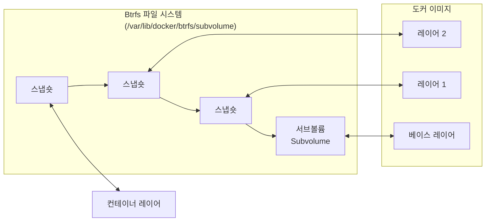

# 스토리지 드라이버의 원리

- 도커 이미지는 읽기 전용 파일로 저장되며, 컨테이너는 얇은 쓰기 레이어를 생성해 고유 공간을 생성함
- 컨테이너 내부에서 읽기/쓰기/수정 작업이 일어날 때는 Copy-On-Write(CoW)를 기반으로 동작함

- 스냅숏은 원본 파일은 읽기 전용으로 사용하되, 이 파일이 변경되면 새로운 공간을 할당하는 개념임
	- 도커 이미지는 읽기 전용으로 이 스냅숏의 원리를 통해 컨테이너 레이어를 관리함
- CoW는 파일 쓰기 작업을 수행할 때 원본 파일을 스냅숏 외부 공간에 복사하고, 복사본에 쓰기를 반영함
- 따라서, 쓰기 작업은 스냅숏 내부 파일이 아닌, 별도의 공간에 복사된 파일에서 이뤄지게 됨

### OverlayFS

- 대부분의 운영체제에서 도커를 설치하면 자동으로 사용되도록 설정되는 파일 시스템 드라이버
- Linux 커널의 OverlayFS를 활용해 여러 디렉토리를 하나의 FS처럼 합쳐 보여주는 유니온 마운트 방식
	- 도커는 컨테이너 레이어가 필요할 때 Linux 커널에게 이를 OverlayFS로 생성하라고 요청함
- 도커는 OverlayFS를 이용해 이미지 레이어를 구성하게 되며, 각각의 요소는 아래와 같음
	- **Container Mount(merged)** : 아래 두 레이어를 하나로 합쳐서 보여주는 가상의 뷰로, 실제로 파일을 복사하여 합치지 않고, OverlayFS가 두 레이어를 실시간으로 합쳐 보여줌
	- **Container Layer(upperdir)** : 컨테이너가 실행될 때 새로 생성되는 읽기/쓰기 레이어로, 컨테이너 내에서의 생성/수정/삭제는 해당 레이어에 기록됨
	- **Image Layer(lowerdir)** : 읽기 전용 레이어로, 이미지가 여러 레이어로 구성된 경우 각 레이어가 모두 lowerdir에 쌓이게 됨
- **장점**
	- 여러 컨테이너가 동일한 이미지 레이어(lowerdir)를 공유하므로 디스크 절약이 가능함
	- 컨테이너 실행 시 파일을 복사하지 않고 레이어를 마운트만 하므로 기동 속도가 빠름
- **단점**
	- CoW 특성상 파일을 처음 수정할 때 파일 전체를 복사하기에 대용량 파일의 경우 초기 레이턴시 발생
	- 파일을 찾을 때 lowerdir를 위부터 순서대로 탐색하므로 레이어가 많을수록 파일 탐색이 느려짐

> [!Question] 유니온 마운트 방식
> 여러 개의 디렉토리를 하나의 디렉토리인 것처럼 합쳐서 보여주는 기법이다. 실제로 파일을 복사하거나 이동하는 게 아니라, 가상의 통합 뷰를 제공한다.

### btrfs 드라이버

- btrfs(B-tree FS)는 리눅스 파일 시스템 중 하나로, SSD 최적화, 데이터 압축 등 다양한 기능을 제공함
	- 이때 B-tree는 파일/블록에 대한 메타데이터를 빠르게 검색하기 위해 사용됨
	- CoW로 인한 동적인 블록 위치 변경과 대용량 파일의 블록 매핑을 효율적으로 관리하기 위해 사용됨
- OverlayFS는 마운트 트릭이지만, btrfs는 파일시스템 자체의 서브볼륨/스냅숏 기능으로 레이러를 관리함
	- 서브볼륨은 btrfs 파일시스템 내에서 독립적인 파일/폴더 계층을 가지는 논리적 파티션 단위로, 일반 폴더처럼 보이고 동작하지만, 내부적으로는 독립된 파일 시스템 트리를 구성함
	- 스냅숏은 서브볼륨의 특정 시험 전체를 복제한 읽기-쓰기 가능한 복사본이며, 변경이 필요할 때만 CoW 방식으로 새 블록에 데이터를 씀
- **장점**
	- 블록 단위 CoW로 스냅숏 생성 비용이 적으며, 도커의 이미지/컨테이너 레이어 관리에 적합함
	- 기본적인 압축 시스템을 파일시스템 레벨에서 지원하며, SSD 환경에서 더 빠른 성능을 제공함
- **단점**
	- 작은 파일을 많이 수정하는 환경에서는 CoW를 위한 오버헤드가 커질 수 있음
	- CoW로 변경 블록이 누적되면 스냅숏 공간이 계속 늘어나 디스크 사용량 예측이 어려워짐

> [!Question] OverlayFS와의 차이
> OverlayFS는 btrfs 같은 특수 파일시스템 없이도 커널 레벨의 마운트 기술로 레이어를 합쳐 보여준다. 그리고 파일을 수정할 때는 lowerdir의 파일을 upperdir로 파일 단위로 통째로 복사한 뒤 수정한다. 반면에 btrfs는 파일을 수정할 때는 블록 CoW로 변경된 블록만 새 공간에 쓰는 방식이다. 이론적으로는 btrfs가 더 효율적이지만, 작은 파일이 많은 환경에서는 오히려 btrfs의 오버헤드가 커질 수 있다.
